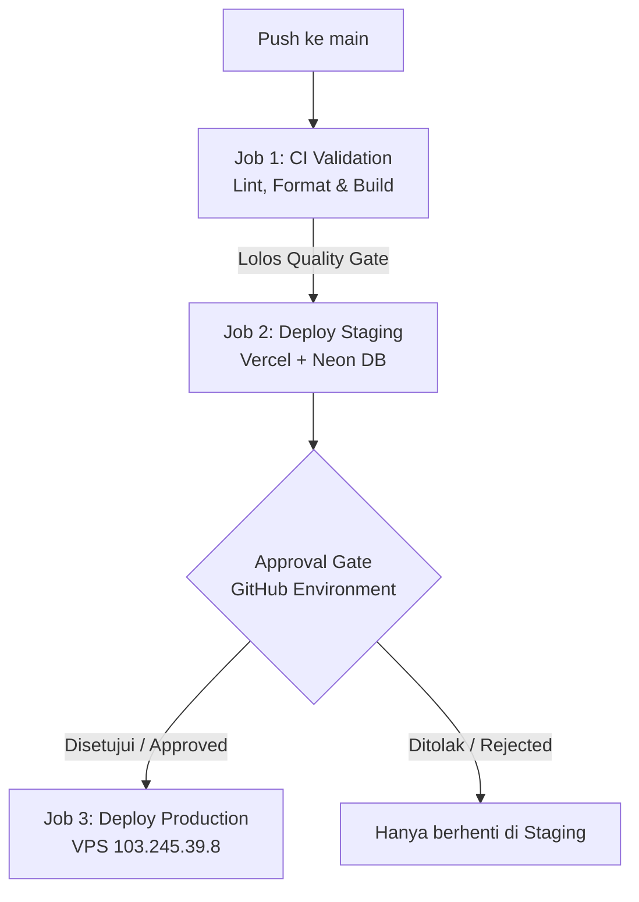

# 🚀 Panduan Setup CI/CD Pipeline Asisya (Staging & Production)

Dokumen ini berisi panduan lengkap untuk melakukan konfigurasi pipeline CI/CD (Continuous Integration / Continuous Deployment) menggunakan **GitHub Actions**, **Vercel** + **Neon DB** (Staging), dan **VPS Ubuntu 24.04** (Production).

---

## 🏗️ Alur Pipeline (Workflow)



1. **CI Validation**: Memeriksa standardisasi penulisan kode (`eslint`), memformat styling (`prettier`), dan memvalidasi kompilasi (`tsc --noEmit` & `vite build`).
2. **Deploy Staging (Vercel)**: Jika lolos CI, kode langsung di-deploy ke Vercel (Staging) yang terhubung ke serverless database Neon.
3. **Manual Approval Gate**: GitHub Actions akan menahan proses rilis sebelum masuk ke VPS Production. Admin/User harus melakukan klik **Approve** di halaman GitHub Actions. Jika di-reject atau didiamkan, rilis baru hanya aktif di Staging.
4. **Deploy Production (VPS)**: Jika disetujui, workflow akan menggunakan koneksi SSH aman untuk melakukan pull, install dependencies, compile, dan reload proses backend under PM2.

---

## 🛠️ Langkah-Langkah Konfigurasi

### 1. Membuat GitHub Environment (Manual Gate)
Untuk membatasi rilis ke VPS memerlukan persetujuan manual:
1. Buka repositori Anda di GitHub.
2. Navigasi ke menu **Settings** > **Environments** (di panel sebelah kiri).
3. Klik tombol **New environment**, beri nama **`production`** lalu klik **Configure environment**.
4. Di bagian **Environment protection rules**:
   - Centang opsi **Required reviewers**.
   - Masukkan username akun GitHub Anda (atau nama tim/akun yang berwenang) sebagai reviewer wajib.
5. Klik **Save protection rules**.

---

### 2. Mengambil Kredensial Vercel (Staging)
Untuk memproses auto-deployment ke Vercel, ambil data parameter berikut:
* **`VERCEL_TOKEN`**:
  1. Masuk ke dashboard [Vercel](https://vercel.com/).
  2. Buka **Account Settings** > **Tokens**.
  3. Buat token baru (misal nama: `asisya-github-actions`), copy nilai token tersebut.
* **`VERCEL_ORG_ID` & `VERCEL_PROJECT_ID`**:
  1. Buka folder proyek di komputer lokal Anda melalui terminal.
  2. Jalankan perintah `pnpm vercel link` untuk menghubungkan proyek ke Vercel Anda (jika belum).
  3. Setelah selesai, buka file `.vercel/project.json` yang terbuat secara otomatis.
  4. Ambil nilai `orgId` (menjadi `VERCEL_ORG_ID`) dan `projectId` (menjadi `VERCEL_PROJECT_ID`).

---

### 3. Mengonfigurasi GitHub Repository Secrets
Tambahkan seluruh parameter kredensial ke repositori GitHub agar dapat diakses oleh runner Actions secara aman:
1. Buka repositori di GitHub, pergi ke **Settings** > **Secrets and variables** > **Actions**.
2. Klik **New repository secret** untuk masing-masing variabel berikut:

| Nama Secret | Deskripsi / Nilai |
| :--- | :--- |
| **`VERCEL_TOKEN`** | Token otentikasi Vercel yang dibuat dari Account Settings. |
| **`VERCEL_ORG_ID`** | ID Organisasi Vercel (`orgId` dari file `.vercel/project.json`). |
| **`VERCEL_PROJECT_ID`** | ID Proyek Vercel (`projectId` dari file `.vercel/project.json`). |
| **`VPS_SSH_HOST`** | IP VPS Production Anda (`103.245.39.8`). |
| **`VPS_SSH_PASSWORD`** | Password SSH VPS Anda (`24@W-WVjbca6`). |

---

### 4. Database Migrations (Neon & VPS)
* **Neon Staging**:
  Neon DB menggunakan skema serverless. Skema dan data default telah diinisialisasi melalui `seed-neon.js`. Apabila Anda memperbarui struktur database (misalnya menambahkan tabel di `migration.sql` atau model baru), jalankan query tersebut langsung di Console Editor halaman Neon dashboard Anda, atau gunakan tool migration client.
* **VPS Production**:
  Di VPS, server backend diimplementasikan dengan fitur **Auto-Schema Migration** (`initDb` pada file `backend/src/config/db.ts`). Setiap kali pipeline selesai melakukan deploy dan memanggil `pm2 reload asisya-backend`, database PostgreSQL di VPS akan secara otomatis memvalidasi skema baru dan menambahkan kolom/tabel baru (menggunakan query `CREATE TABLE IF NOT EXISTS` dan `ALTER TABLE ADD COLUMN IF NOT EXISTS`).

---

## 📈 Cara Menjalankan & Memantau Pipeline

1. Lakukan modifikasi kode atau fitur baru di workspace lokal Anda.
2. Jalankan commit dan push ke branch `main`:
   ```bash
   git add .
   git commit -m "feat: implementasi fitur baru"
   git push origin main
   ```
3. Buka tab **Actions** di repositori GitHub Anda.
4. Klik pada workflow rilis yang sedang berjalan.
5. Setelah rilis staging (`deploy-staging`) berhasil, pipeline akan masuk ke status **Waiting** untuk job `deploy-production`.
6. Klik tombol **Review deployments** di sebelah kanan halaman GitHub Actions, centang environment `production`, kemudian klik **Approve and deploy**.
7. Rilis akan otomatis dideploy menuju VPS Anda. Jika Anda mengeklik **Reject**, rilis baru hanya akan terpasang di Vercel (Staging) dan aman dari gangguan pada lingkungan produksi.
